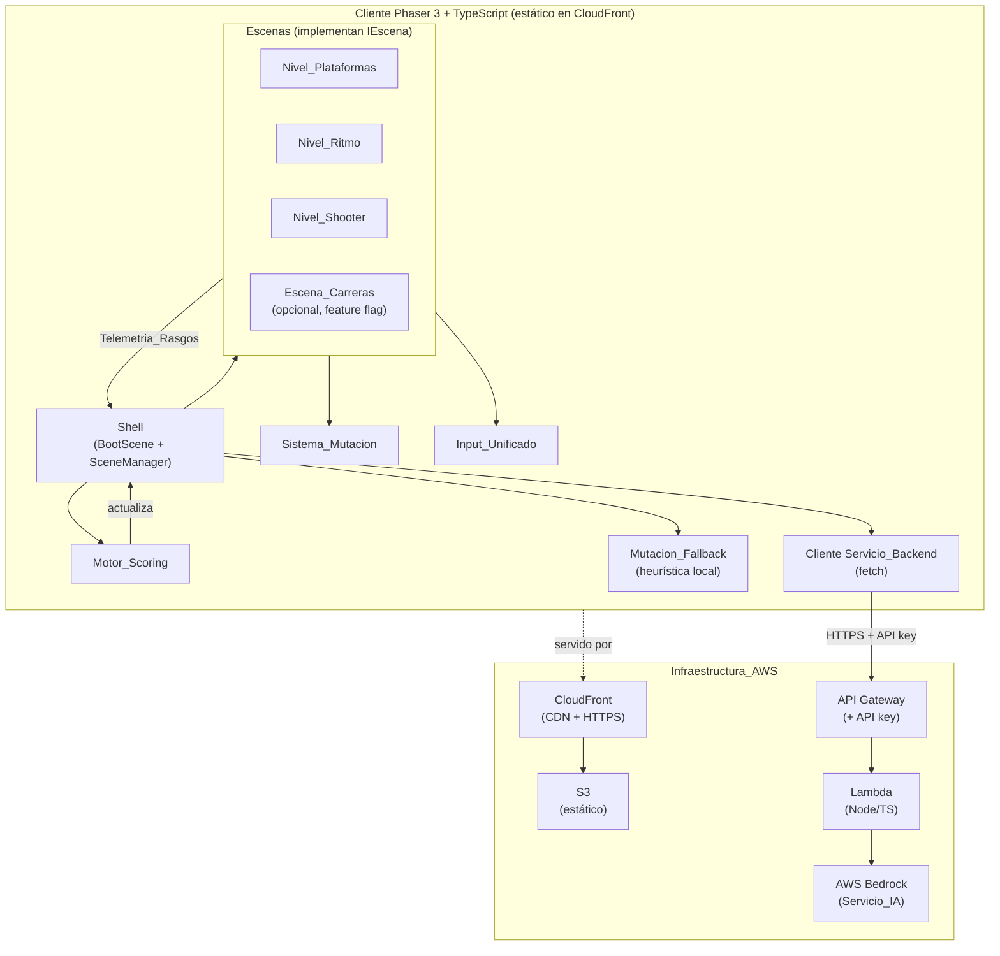
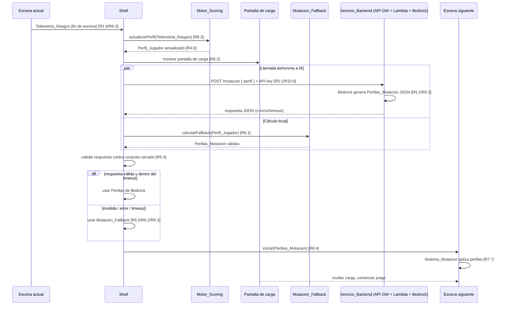

# Design Document

## Overview

Arcade IA Mutante es un cliente de juego arcade 8-bit construido con **Phaser 3 + TypeScript**, servido como sitio estático desde **S3 + CloudFront**, con un backend serverless **API Gateway + Lambda** que intermedia contra **AWS Bedrock**. El corazón del sistema es un bucle determinístico de medición → mutación:

1. El jugador juega una Escena (Nivel_Plataformas, Nivel_Ritmo, Nivel_Shooter, o la opcional Escena_Carreras).
2. Al terminar, la Escena emite `Telemetria_Rasgos` (señal + oportunidad por rasgo).
3. El `Motor_Scoring` normaliza esa telemetría y actualiza el `Perfil_Jugador` acumulado (Furia, Curiosidad, Logro, Riesgo).
4. Durante la pantalla de carga, el `Shell` pide al `Servicio_Backend` unas `Perillas_Mutacion` para la siguiente Escena; en paralelo calcula una `Mutacion_Fallback` heurística local.
5. Se valida estrictamente la respuesta de Bedrock contra un **conjunto cerrado**. Si es válida, se aplica; si falla, tarda o es inválida, se aplica el fallback.
6. La siguiente Escena arranca con las perillas resueltas y el `Sistema_Mutacion` transforma el mundo (paleta, clima, enemigos, música, mensaje).

El principio rector de arquitectura es que **la IA nunca es un punto único de falla** (Requirements 5, 6): el juego siempre avanza dentro de un `timeout`, con o sin Bedrock.

Este diseño está pensado para **tres desarrolladores en paralelo**. El artefacto central que habilita ese paralelismo es el `Contrato_Compartido` (Requirement 9): un conjunto de interfaces TypeScript acordadas el día 1. Cada dev construye una Escena de forma independiente y todo encaja porque respetan el mismo contrato de telemetría, perillas e input.

**Decisiones abiertas:** varios puntos quedan explícitamente pendientes del `Documento_Decisiones` (Requirement 12) y se marcan en línea a lo largo de este documento como `[PENDIENTE — Documento_Decisiones]`.

## Architecture

### Diagrama de componentes



El `Shell` es el único componente que conoce el ciclo de vida completo y el estado global (`Perfil_Jugador`). Las Escenas no se conocen entre sí ni conocen al backend: solo hablan a través del `Contrato_Compartido`. El `Motor_Scoring` y el `Sistema_Mutacion` son librerías puras/casi-puras que las Escenas y el Shell consumen. Esto satisface la separación exigida por Requirement 9.7 (registrar escenas nuevas sin tocar Shell ni Motor_Scoring).

### Diagrama de secuencia del loop de transición



La llamada al backend y el cálculo del fallback ocurren **en paralelo** durante la carga. El fallback está listo *antes* de que llegue la respuesta remota, de modo que resolver la transición nunca depende de Bedrock (Requirements 5.6, 6.2). El bucle de frames de Phaser nunca se bloquea porque el `fetch` es asíncrono (Promise) y la resolución se hace vía callback/evento, no con espera síncrona.

### Stack y decisiones de arquitectura

- **Phaser 3 escenas nativas**: cada Escena del juego es una `Phaser.Scene`. El `Shell` usa el `Phaser.Scene` manager para arrancar/detener escenas. Sobre ese mecanismo nativo construimos nuestra capa de contrato (`IEscena`).
- **Backend en Node/TypeScript sobre Lambda**: se elige Node/TS para compartir tipos del `Contrato_Compartido` entre cliente y Lambda (el esquema de `PerillasMutacion` puede vivir en un paquete compartido y reutilizarse en la validación de ambos lados). Python es una alternativa válida; se recomienda Node por la reutilización de tipos.
- **Estático puro en el cliente**: no hay estado de servidor por jugador. El `Perfil_Jugador` vive en memoria en el `Shell` durante la sesión (Requirement 8.6). No se persiste entre sesiones (no es requisito de la demo).

## Components and Interfaces

### Shell (BootScene + SceneManager)

Responsabilidades:
- `BootScene`: precarga de assets comunes, inicializa el `Perfil_Jugador` con los cuatro rasgos en su estado neutro (Requirement 8.1) y carga la primera Escena (`Nivel_Plataformas`, Requirement 1.1).
- `SceneManager`: orquesta transiciones, pantallas de carga, y mantiene el `Perfil_Jugador` en memoria durante toda la sesión (Requirement 8.6).
- Recibe `Telemetria_Rasgos` de la Escena que termina y la entrega al `Motor_Scoring` (Requirement 8.3).
- Dispara la resolución de `Perillas_Mutacion` (Bedrock + fallback) durante la carga (Requirements 5.1, 8.2) y entrega las perillas resueltas a la siguiente Escena antes de iniciarla (Requirement 8.4).
- En retorno de nivel oculto, vuelve al `Nivel_Plataformas` aplicando las perillas resueltas para el retorno (Requirement 8.5).

Interfaz pública del Shell (consumida por las Escenas):

```typescript
interface IShell {
  // Una escena solicita transición hacia otra escena (por id lógico).
  solicitarTransicion(destino: EscenaId): void;
  // Una escena entrega su telemetría al terminar.
  reportarTelemetria(telemetria: TelemetriaRasgos): void;
  // Acceso de solo lectura al perfil acumulado (para depuración / HUD).
  obtenerPerfil(): Readonly<PerfilJugador>;
}
```

### Interface de Escena (`IEscena`) — pieza central del Contrato_Compartido

Todas las Escenas implementan esta interfaz. Es el contrato que permite el trabajo en paralelo de los tres devs (Requirement 9). Se apoya en el ciclo de vida de `Phaser.Scene` pero añade los métodos del contrato:

```typescript
type EscenaId = 'plataformas' | 'ritmo' | 'shooter' | 'carreras';
type Rasgo = 'furia' | 'curiosidad' | 'logro' | 'riesgo';

interface DeclaracionRasgos {
  // Tope de Oportunidad que la escena ofrece por rasgo (Requirement 4.2).
  // Si un rasgo no se mide, su tope es 0 (Requirement 4.5).
  oportunidadMaxima: Record<Rasgo, number>;
}

interface IEscena {
  readonly id: EscenaId;

  // --- Ciclo de vida (envoltura sobre Phaser.Scene) ---
  // Se llama antes de create(); recibe las perillas ya resueltas por el Shell.
  init(datos: DatosInicioEscena): void;
  preload(): void;
  create(): void;
  update(tiempo: number, deltaMs: number): void;

  // --- Contrato_Compartido ---
  // Declara qué rasgos mide y sus topes de oportunidad (Requirement 4.2).
  declararRasgos(): DeclaracionRasgos;

  // Aplica las Perillas_Mutacion recibidas (Requirements 2.5, 3.6, 9.4).
  aplicarPerillas(perillas: PerillasMutacion): void;

  // Emite la telemetría al terminar (Requirements 1.8, 2.6, 3.7, 9.1).
  // La escena la construye y la pasa al Shell vía reportarTelemetria().
  construirTelemetria(): TelemetriaRasgos;

  // Consume el input unificado (Requirement 9.5, 9.6).
  setInput(input: InputUnificado): void;
}

interface DatosInicioEscena {
  perillas: PerillasMutacion;
  shell: IShell;
  input: InputUnificado;
}
```

Contrato de secuencia que toda Escena respeta:
1. `Shell` construye la Escena y llama `init(datos)` con las `PerillasMutacion` resueltas.
2. Antes de medir, la Escena publica su `declararRasgos()` al `Motor_Scoring` vía el Shell (Requirement 4.2).
3. En `create()` la Escena llama `aplicarPerillas()` (Requirements 2.5, 3.6).
4. Durante el juego, la Escena lee `InputUnificado` (Requirement 9.6) y acumula señales por rasgo.
5. Al terminar, construye `TelemetriaRasgos` y llama `shell.reportarTelemetria(...)` seguido de `shell.solicitarTransicion(...)`.

### Motor_Scoring

Librería pura sin estado de Phaser. Ver detalle en la sección Motor_Scoring más abajo.

```typescript
interface IMotorScoring {
  // Registra la declaración de una escena antes de medir (Requirement 4.2).
  registrarDeclaracion(escena: EscenaId, decl: DeclaracionRasgos): void;
  // Calcula Score_Rasgo por rasgo y actualiza el perfil acumulado (Requirements 4.3-4.6).
  actualizarPerfil(perfilActual: PerfilJugador, telemetria: TelemetriaRasgos): PerfilJugador;
}
```

### Sistema_Mutacion

Aplica cada perilla a una Escena reutilizando sprites existentes (Requirement 7). Ver detalle en la sección Sistema_Mutacion.

```typescript
interface ISistemaMutacion {
  aplicar(scene: Phaser.Scene, perillas: PerillasMutacion, ctx: ContextoMutacion): void;
}

interface ContextoMutacion {
  spritesTintables: Phaser.GameObjects.Sprite[]; // para la paleta
  capaClima: Phaser.GameObjects.Particles.ParticleEmitterManager;
  spawnerEnemigos?: SpawnerEnemigos;             // intensidad + agresividad
  audio: GestorAudio;                            // mood_musica
  overlayTexto: OverlayTexto;                    // mensaje
}
```

### Cliente del Servicio_Backend

```typescript
interface IClienteBackend {
  // Devuelve las perillas remotas o rechaza (timeout / error / red).
  pedirMutacion(
    perfil: PerfilJugador,
    proximaEscena: EscenaId,
    opts: { timeoutMs: number; signal?: AbortSignal }
  ): Promise<unknown>; // 'unknown' a propósito: se valida en el Shell (Requirement 5.4).
}
```

Se devuelve `unknown` deliberadamente: la respuesta de Bedrock es **no confiable** hasta que el `Shell` la valide contra el conjunto cerrado (Requirements 5.4, 5.5).

### Servicio_Backend (Lambda)

- Handler HTTP detrás de API Gateway (Requirement 10.3).
- Verifica autorización (API key) antes de invocar Bedrock (Requirements 10.6). Sin autorización válida → 401/403 sin llamar a Bedrock.
- Construye el prompt, invoca Bedrock (Requirement 10.4), parsea y **valida** la salida contra el conjunto cerrado, y devuelve JSON conforme (Requirement 5.3). Si Bedrock devuelve algo inválido, la Lambda puede intentar reparar o devolver error; la defensa final siempre está en el cliente.

## Data Models

### PerfilJugador

```typescript
interface PerfilJugador {
  // Cada rasgo en [0,1]. Estado neutro inicial = 0 con peso acumulado 0.
  rasgos: Record<Rasgo, number>;
  // Peso acumulado por rasgo (suma de Peso_Rasgo de escenas que lo midieron).
  // Necesario para el promedio ponderado incremental (Requirement 4.6).
  pesoAcumulado: Record<Rasgo, number>;
}
```

### TelemetriaRasgos (Requirement 9.1)

```typescript
interface SenalOportunidad {
  senal: number;       // acciones relevantes realizadas (>= 0)
  oportunidad: number; // tope de acciones que la escena ofreció (>= 0)
}

interface TelemetriaRasgos {
  escena: EscenaId;
  porRasgo: {
    furia: SenalOportunidad;
    curiosidad: SenalOportunidad;
    logro: SenalOportunidad;
    riesgo: SenalOportunidad;
  };
}
```

### PerillasMutacion — conjunto cerrado (Requirement 9.2)

```typescript
type Paleta      = 'infierno' | 'sueno' | 'neon' | 'hostil';
type Clima       = 'ninguno' | 'lluvia' | 'brasas' | 'niebla';
type MoodMusica  = 'calma' | 'epico' | 'tenso' | 'furioso';

interface PerillasMutacion {
  paleta: Paleta;
  intensidad_enemigos: number; // rango [0, 1] inclusive
  agresividad: number;         // rango [0, 1] inclusive
  clima: Clima;
  mood_musica: MoodMusica;
  mensaje: string;             // texto corto (se recorta a un máximo, p. ej. 80 chars)
}
```

Conjuntos cerrados y rangos usados por el validador del Shell (Requirement 5.4):

```typescript
const PALETAS   = ['infierno', 'sueno', 'neon', 'hostil'] as const;
const CLIMAS    = ['ninguno', 'lluvia', 'brasas', 'niebla'] as const;
const MOODS     = ['calma', 'epico', 'tenso', 'furioso'] as const;
const MAX_MENSAJE = 80;

function esPerillasValidas(x: unknown): x is PerillasMutacion {
  if (typeof x !== 'object' || x === null) return false;
  const p = x as Record<string, unknown>;
  return (
    typeof p.paleta === 'string' && (PALETAS as readonly string[]).includes(p.paleta) &&
    typeof p.clima === 'string' && (CLIMAS as readonly string[]).includes(p.clima) &&
    typeof p.mood_musica === 'string' && (MOODS as readonly string[]).includes(p.mood_musica) &&
    typeof p.intensidad_enemigos === 'number' && p.intensidad_enemigos >= 0 && p.intensidad_enemigos <= 1 &&
    typeof p.agresividad === 'number' && p.agresividad >= 0 && p.agresividad <= 1 &&
    typeof p.mensaje === 'string' && p.mensaje.length <= MAX_MENSAJE
  );
}
```

### InputUnificado (Requirement 9.5) — abstracto

Abstracción de teclado (único medio de input). El **mapa exacto de teclas queda `[PENDIENTE — Documento_Decisiones]`** (Requirement 12.1). La abstracción se define ahora para permitir el trabajo en paralelo; el binding concreto se resuelve luego sin cambiar las Escenas.

```typescript
interface InputUnificado {
  // Direcciones (vector normalizado -1..1 por eje).
  direccion(): { x: number; y: number };
  // Acción primaria: saltar (plataformas) / golpear ritmo / disparar (shooter).
  accionPrimaria(): boolean;      // presionada este frame
  accionPrimariaJustPressed(): boolean;
  // Acción secundaria (uso específico por escena; p. ej. dash / acción alterna).
  accionSecundaria(): boolean;
  accionSecundariaJustPressed(): boolean;
  // Pausa.
  pausa(): boolean;
}
```

El mismo `InputUnificado` se inyecta en las tres Escenas garantizando idéntico mapa de teclas (Requirements 9.5, 9.6). Las Escenas nunca leen el teclado de Phaser directamente.

## Motor_Scoring

El `Motor_Scoring` es **puro y determinístico** (Requirement 4.7): dada la misma secuencia de telemetrías, produce el mismo `Perfil_Jugador`.

### Fórmula

Para cada rasgo `r` en una escena:

- **Score_Rasgo** (Requirements 4.3, 4.4):
  ```
  score_r = clamp(senal_r / oportunidad_r, 0, 1)   si oportunidad_r > 0
  ```
- **Peso_Rasgo** (Requirement 4.5):
  ```
  peso_r = oportunidad_r > 0 ? 1 : 0
  ```
  Si `oportunidad_r == 0`, el rasgo se excluye del cálculo del perfil para esa escena (peso 0), evitando división por cero y no contaminando el promedio.

  > Nota de diseño: se usa `peso = 1` cuando la escena mide el rasgo. El mapa fino de pesos por rasgo/escena (si el equipo decide ponderar distinto) queda `[PENDIENTE — Documento_Decisiones]` (Requirement 12.3). La fórmula soporta cualquier peso ≥ 0.

- **Perfil_Jugador** como promedio ponderado acumulado incremental (Requirement 4.6). Manteniendo `pesoAcumulado_r` y `perfil_r`:
  ```
  pesoNuevo_r   = pesoAcumulado_r + peso_r
  perfil_r'     = (perfil_r * pesoAcumulado_r + score_r * peso_r) / pesoNuevo_r   si pesoNuevo_r > 0
  perfil_r'     = perfil_r                                                        si pesoNuevo_r == 0
  ```
  Esta forma incremental es matemáticamente igual al promedio ponderado sobre todas las escenas, y es determinística porque no depende de wall-clock ni de aleatoriedad.

### Determinismo

- No se usa `Math.random`, `Date.now` ni estado externo dentro del motor.
- Las operaciones son aritmética pura sobre los valores de telemetría.
- El orden de acumulación está fijado por el orden de escenas; el promedio ponderado incremental es asociativo respecto a ese orden fijo.

## Sistema_Mutacion

Cada perilla se implementa en Phaser **sin arte nuevo** (Requirement 7.7), reutilizando los sprites existentes:

| Perilla | Implementación en Phaser | Requirement |
|---|---|---|
| `paleta` | `setTint()` sobre los sprites existentes con una paleta de tintes por valor (`infierno`, `sueno`, `neon`, `hostil`). Un mapa `paleta → color(s) de tinte`. | 7.1 |
| `intensidad_enemigos` | Parámetro `[0,1]` que escala la densidad de spawn: `n_enemigos = round(lerp(min, max, intensidad))`. | 7.2 |
| `agresividad` | Parámetro `[0,1]` que ajusta la IA de enemigos: velocidad, frecuencia de ataque, rango de detección (`lerp` sobre cada parámetro). | 7.3 |
| `clima` | `ParticleEmitterManager`: `ninguno` (sin emitter), `lluvia` (partículas verticales), `brasas` (partículas ascendentes cálidas), `niebla` (overlay de partículas suaves + alpha). | 7.4 |
| `mood_musica` | `GestorAudio` selecciona la pista según `calma`/`epico`/`tenso`/`furioso` (crossfade entre pistas CC0 pre-cargadas). | 7.5 |
| `mensaje` | `OverlayTexto`: muestra el texto corto de la IA como overlay temporal al iniciar la escena. | 7.6 |

Diseño clave: el `Sistema_Mutacion` recibe un `ContextoMutacion` que la Escena arma con sus propias referencias (sus sprites, su emitter, su spawner). Así el sistema es genérico y cada Escena decide qué exponer. La reutilización de sprites se logra porque la paleta es solo un tinte y el clima/enemigos/música son capas sobre los assets existentes (Requirement 7.7).

El mapa fino de valores de perillas por perfil queda `[PENDIENTE — Documento_Decisiones]` (Requirement 12.3); el diseño solo fija los mecanismos.

## Integración Bedrock + Fallback

### Elección del modelo de Bedrock

**Recomendación: Claude 3.5 Haiku** (o **Amazon Nova Lite** como alternativa igualmente válida). Razones:

- **Costo bajo y latencia baja**: son los modelos más económicos y rápidos de sus familias, ideales para un payload pequeño (un perfil de 4 números → un JSON de 6 campos). El costo esperado es muy bajo porque **solo se invoca entre escenas** (unas pocas llamadas por partida), no por frame.
- **Suficiente capacidad**: la tarea es trivial para un LLM pequeño (mapear un perfil a un conjunto cerrado de perillas y una frase corta). No se necesita un modelo grande.
- **Disponibilidad en Bedrock**: ambos están disponibles en Bedrock con `InvokeModel`, cumpliendo el requisito duro de usar AWS (Requirement 10.4).

Nova Lite es marginalmente más barato; Claude Haiku suele seguir instrucciones de "devolvé solo JSON" con gran fiabilidad. Cualquiera cumple; la decisión final entre ambos queda como afinamiento del equipo.

### Diseño del prompt

**System prompt** (fija el rol y el formato de salida estricto):

```
Sos el director creativo de un juego arcade. Recibís un perfil de jugador con
cuatro rasgos en [0,1]: furia, curiosidad, logro, riesgo. Devolvés EXCLUSIVAMENTE
un objeto JSON válido, sin texto adicional, sin markdown, con EXACTAMENTE estos campos:
- paleta: uno de "infierno" | "sueno" | "neon" | "hostil"
- intensidad_enemigos: número entre 0 y 1
- agresividad: número entre 0 y 1
- clima: uno de "ninguno" | "lluvia" | "brasas" | "niebla"
- mood_musica: uno de "calma" | "epico" | "tenso" | "furioso"
- mensaje: frase corta (máximo 80 caracteres) dirigida al jugador
No incluyas ningún otro campo ni valores fuera de estos conjuntos.
```

**User prompt**: el `Perfil_Jugador` serializado + la `proximaEscena`. Se puede usar la respuesta estructurada del modelo si está disponible para forzar el esquema. Independientemente, la validación estricta en el cliente es la garantía real.

### Validación estricta (Shell)

El Shell aplica `esPerillasValidas()` (ver Data Models) a la respuesta. Cualquier campo faltante, tipo incorrecto, valor fuera del conjunto cerrado o número fuera de `[0,1]` → se descarta la respuesta y se usa `Mutacion_Fallback` (Requirements 5.4, 5.5). El `mensaje` se recorta defensivamente a `MAX_MENSAJE`.

### Timeout y no bloqueo

- La llamada usa `fetch` con `AbortController` y `timeoutMs` configurable (recomendado 1500–2500 ms, dentro de la pantalla de carga).
- El bucle de frames de Phaser nunca espera: la resolución se hace por Promise/evento (Requirement 5.6).
- Si el timeout vence o la Promise rechaza (error de red, 5xx, 401), se resuelve con `Mutacion_Fallback` (Requirements 6.2, 6.3).

### Mutacion_Fallback (heurística local)

Se calcula **siempre** en cada transición, en paralelo con la llamada remota (Requirement 6.1). Es una función pura `PerfilJugador → PerillasMutacion` que garantiza salida válida (Requirement 6.4). Ejemplo de heurística:

```
paleta:      rasgo dominante → furia:'infierno', riesgo:'hostil', curiosidad:'sueno', logro:'neon'
intensidad:  = clamp(furia, 0, 1)
agresividad: = clamp((furia + riesgo) / 2, 0, 1)
clima:       riesgo alto → 'brasas'; curiosidad alta → 'niebla'; furia alta → 'lluvia'; si no → 'ninguno'
mood_musica: furia alta → 'furioso'; riesgo alto → 'tenso'; logro alto → 'epico'; si no → 'calma'
mensaje:     plantilla local corta según rasgo dominante (sin IA)
```

El mapa fino exacto queda `[PENDIENTE — Documento_Decisiones]` (Requirement 12.3); el diseño garantiza que el fallback siempre produce perillas válidas del conjunto cerrado.

### Autorización del endpoint (Requirement 10.6)

- API Gateway exige una **API key** (header `x-api-key`) o autorizador equivalente.
- La Lambda verifica la autorización **antes** de invocar Bedrock. Sin autorización válida → rechazo (401/403) sin invocar el Servicio_IA, evitando abuso y costo indebido.
- CORS configurado para permitir el origen de CloudFront (ver Riesgos).

## Extensibilidad N-Escenas

Para registrar la `Escena_Carreras` (u otras) **sin tocar Shell ni Motor_Scoring** (Requirements 9.7, 12.5):

- Existe un **registro declarativo** de escenas: una lista/mapa `EscenaId → constructor de IEscena` más un **feature flag** por escena.
  ```typescript
  interface RegistroEscena {
    id: EscenaId;
    crear: () => IEscena;
    habilitada: boolean; // feature flag
  }
  const REGISTRO_ESCENAS: RegistroEscena[] = [
    { id: 'plataformas', crear: () => new NivelPlataformas(), habilitada: true },
    { id: 'ritmo',       crear: () => new NivelRitmo(),       habilitada: true },
    { id: 'shooter',     crear: () => new NivelShooter(),     habilitada: true },
    { id: 'carreras',    crear: () => new EscenaCarreras(),   habilitada: false }, // opcional
  ];
  ```
- El `Shell` itera el registro y solo instancia escenas `habilitada === true`. Añadir carreras = poner `habilitada: true` y proveer una clase que implemente `IEscena`. Como `Escena_Carreras` declara sus propios rasgos vía `declararRasgos()` y consume `InputUnificado` y `PerillasMutacion` como cualquier otra, el `Motor_Scoring` y el `Sistema_Mutacion` la tratan sin cambios.
- Guía no vinculante de medición en carreras (del requirements): Furia = embestir rivales, Curiosidad = rutas/atajos, Logro = checkpoints y posición, Riesgo = velocidad sostenida y pasadas al ras. El enfoque técnico (pseudo-3D OutRun vs esquiva-carriles) queda `[PENDIENTE — Documento_Decisiones]` (Requirements 12.5, 12.6).

## Correctness Properties

*Una propiedad es una característica o comportamiento que debe mantenerse verdadero en todas las ejecuciones válidas de un sistema — esencialmente, una afirmación formal sobre lo que el sistema debe hacer. Las propiedades sirven de puente entre las especificaciones legibles por humanos y las garantías de correctitud verificables por máquina.*

PBT es apropiado aquí porque el `Motor_Scoring`, el validador de perillas y el `Mutacion_Fallback` son funciones puras con propiedades universales (rangos, invariantes, determinismo). El resto (render de Phaser, spawns, audio, infra AWS) se cubre con tests de ejemplo/integración/smoke (ver Testing Strategy).

### Property 1: Score_Rasgo siempre en [0,1]

*Para toda* `TelemetriaRasgos` con valores de `senal >= 0` y `oportunidad >= 0`, el `Score_Rasgo` calculado por el `Motor_Scoring` para cada rasgo está siempre en el rango `[0.0, 1.0]` inclusive (incluso si `senal > oportunidad`, por el acotamiento).

**Validates: Requirements 4.3, 4.4**

### Property 2: Oportunidad 0 ⇒ peso 0 y no afecta el perfil

*Para todo* `PerfilJugador` y toda `TelemetriaRasgos` donde un rasgo tiene `oportunidad == 0`, actualizar el perfil deja el valor acumulado de ese rasgo **idéntico** al previo (peso 0, exclusión del cálculo), sin producir `NaN` ni división por cero.

**Validates: Requirements 4.5**

### Property 3: El perfil acumulado permanece en [0,1]

*Para toda* secuencia de `TelemetriaRasgos` válidas aplicadas sobre el perfil inicial, cada rasgo del `Perfil_Jugador` resultante permanece en `[0.0, 1.0]` (invariante del promedio ponderado de valores en `[0,1]`).

**Validates: Requirements 4.4, 4.6**

### Property 4: Determinismo del perfil

*Para toda* secuencia de `TelemetriaRasgos`, calcular el `Perfil_Jugador` dos veces (o desde dos instancias del motor) a partir del mismo estado inicial produce exactamente el mismo `Perfil_Jugador`.

**Validates: Requirements 4.7**

### Property 5: Toda Perillas_Mutacion aplicada pertenece al conjunto cerrado

*Para toda* respuesta arbitraria del `Servicio_Backend` (válida, inválida, malformada o parcial), las `PerillasMutacion` que el `Shell` termina aplicando pertenecen siempre al conjunto cerrado y a sus rangos válidos (`paleta`/`clima`/`mood_musica` en sus enums, `intensidad_enemigos`/`agresividad` en `[0,1]`, `mensaje` de longitud ≤ máximo), porque provienen de una respuesta validada o del fallback.

**Validates: Requirements 5.4, 5.5, 6.4, 9.2**

### Property 6: El fallback siempre produce perillas válidas

*Para todo* `PerfilJugador`, `Mutacion_Fallback` produce una `PerillasMutacion` que satisface `esPerillasValidas()`.

**Validates: Requirements 6.1, 6.4**

### Property 7: El juego nunca queda bloqueado esperando a Bedrock

*Para toda* condición del `Servicio_Backend` (respuesta lenta más allá del timeout, error, red caída, respuesta inválida), la resolución de la transición del `Shell` siempre completa dentro del `timeout` con unas `PerillasMutacion` válidas (remotas si válidas y a tiempo, o del fallback en cualquier otro caso).

**Validates: Requirements 5.6, 6.2, 6.3, 6.5**

### Property 8: La validación rechaza todo lo que esté fuera del conjunto cerrado

*Para todo* objeto que contenga al menos un campo fuera del conjunto cerrado o de su rango (enum inválido, número fuera de `[0,1]`, campo faltante, tipo incorrecto), `esPerillasValidas()` devuelve `false`; y *para toda* `PerillasMutacion` bien formada, devuelve `true`.

**Validates: Requirements 5.4, 9.2**

## Error Handling

- **Bedrock lento / caído / error (5xx) / red**: `AbortController` corta al vencer `timeoutMs`; el `Shell` resuelve con `Mutacion_Fallback` (Requirements 6.2, 6.3). El jugador nunca ve una interrupción (Requirement 6.5): la pantalla de carga siempre termina.
- **Respuesta de Bedrock inválida o malformada**: `esPerillasValidas()` devuelve `false` → se descarta y se usa fallback (Requirements 5.4, 5.5). El parseo JSON se envuelve en try/catch; un JSON no parseable se trata como inválido.
- **Autorización faltante en el backend**: API Gateway/Lambda rechaza sin invocar Bedrock (Requirement 10.6).
- **Telemetría con `oportunidad == 0`**: manejada por diseño en el Motor_Scoring (peso 0, sin división por cero — Property 2).
- **Assets faltantes en preload**: `BootScene` maneja errores de carga de Phaser con un placeholder y continúa (no bloquea la demo).
- **Transición solicitada a un id no habilitado**: el `Shell` ignora o cae a la escena por defecto (evita romper el flujo si un feature flag está apagado).

## Testing Strategy

Enfoque dual: **tests de propiedades** para la lógica pura y universal, **tests de ejemplo/integración/smoke** para lo demás.

### Property-based testing (lógica pura)

- **Librería**: `fast-check` (ecosistema TypeScript/Jest o Vitest). No se implementa PBT desde cero.
- **Configuración**: mínimo **100 iteraciones** por propiedad.
- **Etiquetado**: cada test de propiedad lleva un comentario con el formato
  `Feature: arcade-ia-mutante, Property {número}: {texto de la propiedad}`.
- Cada una de las Properties 1–8 se implementa con **un único** test de propiedad:
  - Properties 1–4 → generadores de `TelemetriaRasgos` y secuencias, sobre `Motor_Scoring`.
  - Properties 5, 7 → generador de respuestas de backend arbitrarias (válidas/ inválidas/ malformadas) + backend mockeado (respuesta lenta, error, red caída) para verificar resolución dentro del timeout con perillas válidas. Se mockea el `fetch`/cliente para no llamar a AWS.
  - Property 6 → generador de `PerfilJugador`, sobre `Mutacion_Fallback`.
  - Property 8 → generadores de objetos válidos e inválidos, sobre `esPerillasValidas()`.

### Unit tests de ejemplo y edge cases

- Motor_Scoring: casos concretos (`senal > oportunidad` acota a 1; primera escena; rasgo nunca medido).
- Validador: ejemplos concretos por cada enum inválido y por límites `0` y `1`.
- Fallback: perfiles neutro, dominante-furia, dominante-riesgo → perillas esperadas.
- Sistema_Mutacion: verificación de que `aplicar()` invoca `setTint`, crea/omite emitter según clima, selecciona pista correcta y muestra overlay (con mocks de Phaser).

### Integración y smoke (no PBT)

- **Integración backend**: 1–3 ejemplos contra la Lambda (o mock local) verificando que devuelve JSON válido y que sin API key rechaza (Requirement 10.6).
- **Smoke de infra**: verificación de que el sitio carga desde CloudFront y que el endpoint responde (Requirements 10.2, 10.5). Un solo pase, no PBT.
- **E2E ligero**: un flujo de escena → transición → siguiente escena, con backend mockeado, para confirmar el loop completo del `Shell`.

Justificación de por qué NO se usa PBT en ciertas áreas: el render de Phaser, la selección de partículas/audio y la infra AWS (S3/CloudFront/API Gateway) son declarativos o dependientes de servicios externos, cuyo comportamiento no varía significativamente con la entrada; se cubren mejor con ejemplos/mocks/smoke.
