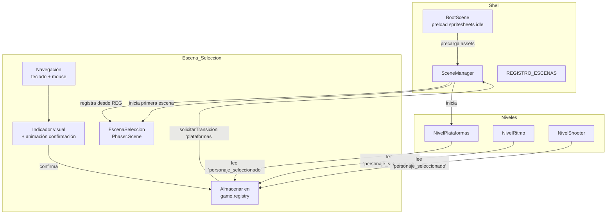

# Design Document: Character Selection Screen

## Overview

La Escena_Seleccion es una pantalla intermedia del Shell (no jugable) que se presenta al jugador inmediatamente después del arranque del juego y antes de iniciar cualquier nivel. Muestra los tres personajes disponibles (Pink Monster, Owlet Monster, Dude Monster) con sus animaciones idle en pixel art, permite la navegación con teclado y mouse, y persiste la elección en el registro de sesión de Phaser (`game.registry`) para que todos los niveles posteriores utilicen el personaje elegido.

### Decisiones clave de diseño

1. **Escena del Shell, no jugable**: `Escena_Seleccion` NO implementa `IEscena` (no emite telemetría ni declara rasgos). Es infraestructura del Shell, igual que `BootScene` y `LoadingScene`.
2. **Precarga en BootScene**: Los spritesheets idle se precargan en `BootScene.preload()` antes de que la Escena_Seleccion se construya, garantizando reproducción inmediata de las animaciones.
3. **Integración con registroEscenas**: Se añade una entrada al `REGISTRO_ESCENAS` con `habilitada: true` para que el SceneManager la registre. Se modifica `PRIMERA_ESCENA` para que apunte a la Escena_Seleccion en lugar de directamente a `plataformas`.
4. **Persistencia vía game.registry**: El `Id_Personaje` seleccionado se almacena bajo la clave `'personaje_seleccionado'` en el registro global de Phaser, accesible por todas las escenas sin acoplamiento directo.

## Architecture



### Flujo de datos

1. `BootScene.preload()` carga los 3 spritesheets idle (32×32, 4 frames cada uno).
2. `BootScene.create()` construye el SceneManager, que registra `EscenaSeleccion` desde `REGISTRO_ESCENAS`.
3. El SceneManager inicia `EscenaSeleccion` como primera escena (no `plataformas`).
4. El jugador navega con flechas/clic y confirma con Enter/Espacio/doble-clic.
5. Al confirmar: se almacena el `Id_Personaje` en `game.registry.set('personaje_seleccionado', id)`, se reproduce la animación de escala, y se invoca `solicitarTransicion('plataformas')` vía IShell.
6. Cada escena de nivel lee `game.registry.get('personaje_seleccionado')` al iniciar para cargar el spritesheet correcto. Si el valor es nulo/inválido, redirige a la Escena_Seleccion.

## Components and Interfaces

### EscenaSeleccion (Phaser.Scene)

```typescript
/**
 * Id lógico de la escena de selección dentro del registro de escenas.
 * Se añade al tipo EscenaId como 'seleccion_personaje'.
 */
export const ID_SELECCION: EscenaId = 'seleccion_personaje';

/** Clave del registro de sesión donde se persiste la selección. */
export const CLAVE_PERSONAJE = 'personaje_seleccionado';

/** Identificadores válidos de personaje. */
export type IdPersonaje = 'pink_monster' | 'owlet_monster' | 'dude_monster';

/** Datos de configuración de cada personaje mostrado. */
export interface DatosPersonaje {
  id: IdPersonaje;
  nombre: string;
  spriteKey: string;
  animKey: string;
}

export class EscenaSeleccion extends Phaser.Scene {
  private indiceActual: number = 0;
  private personajes: DatosPersonaje[];
  private sprites: Phaser.GameObjects.Sprite[];
  private indicador: Phaser.GameObjects.Rectangle | null;
  private inputDeshabilitado: boolean = false;
  private shell: IShell | null = null;

  constructor();
  
  // Ciclo de vida Phaser
  init(datos?: { shell?: IShell }): void;
  create(): void;
  
  // Métodos internos
  private crearSprites(): void;
  private crearIndicador(): void;
  private registrarInput(): void;
  private navegarIzquierda(): void;
  private navegarDerecha(): void;
  private seleccionarPorClic(indice: number): void;
  private confirmarSeleccion(): void;
  private animarConfirmacion(sprite: Phaser.GameObjects.Sprite, callback: () => void): void;
  private deshabilitarInput(): void;
  private actualizarIndicador(): void;
}
```

### Modificaciones al Shell existente

#### EscenaId (contrato/rasgos.ts)
```typescript
// Se amplía con el nuevo id:
export type EscenaId = 'plataformas' | 'ritmo' | 'shooter' | 'carreras' | 'seleccion_personaje';
```

#### registroEscenas.ts
```typescript
// Se añade la entrada de EscenaSeleccion con habilitada: true
import { EscenaSeleccion } from '../escenas/EscenaSeleccion';

// Dentro de REGISTRO_ESCENAS, antes de las escenas jugables:
{ id: 'seleccion_personaje', crear: () => new EscenaSeleccion(), habilitada: true },
```

#### SceneManager.ts
```typescript
// Se modifica PRIMERA_ESCENA:
export const PRIMERA_ESCENA: EscenaId = 'seleccion_personaje';
```

#### BootScene.ts — preload()
```typescript
preload(): void {
  // Spritesheets idle para la pantalla de selección (Requirement 5.1)
  this.load.spritesheet('pink_monster_idle', 
    'src/assets/personajes/1 Pink_Monster/Pink_Monster_Idle_4.png',
    { frameWidth: 32, frameHeight: 32 });
  this.load.spritesheet('owlet_monster_idle',
    'src/assets/personajes/2 Owlet_Monster/Owlet_Monster_Idle_4.png',
    { frameWidth: 32, frameHeight: 32 });
  this.load.spritesheet('dude_monster_idle',
    'src/assets/personajes/3 Dude_Monster/Dude_Monster_Idle_4.png',
    { frameWidth: 32, frameHeight: 32 });
}
```

### Integración con Escenas de Nivel

Cada escena de nivel, al inicio de su método `create()`, lee la selección del personaje:

```typescript
// Dentro de NivelPlataformas.create(), NivelRitmo.create(), etc.
const idPersonaje = this.registry.get(CLAVE_PERSONAJE) as IdPersonaje | null;
if (!idPersonaje || !['pink_monster', 'owlet_monster', 'dude_monster'].includes(idPersonaje)) {
  // Redirigir a selección
  this.shell?.solicitarTransicion('seleccion_personaje');
  return;
}
// Usar el spritesheet correspondiente al idPersonaje
```

## Data Models

### Constantes de personaje

```typescript
const PERSONAJES: readonly DatosPersonaje[] = [
  {
    id: 'pink_monster',
    nombre: 'Pink Monster',
    spriteKey: 'pink_monster_idle',
    animKey: 'pink_monster_idle_anim',
  },
  {
    id: 'owlet_monster',
    nombre: 'Owlet Monster',
    spriteKey: 'owlet_monster_idle',
    animKey: 'owlet_monster_idle_anim',
  },
  {
    id: 'dude_monster',
    nombre: 'Dude Monster',
    spriteKey: 'dude_monster_idle',
    animKey: 'dude_monster_idle_anim',
  },
] as const;
```

### Estado de la escena

| Campo | Tipo | Descripción |
|-------|------|-------------|
| `indiceActual` | `number` (0-2) | Índice del personaje actualmente resaltado |
| `inputDeshabilitado` | `boolean` | Flag que bloquea toda entrada durante la animación de confirmación |
| `sprites` | `Phaser.GameObjects.Sprite[]` | Los 3 sprites de personaje renderizados |
| `indicador` | `Phaser.GameObjects.Rectangle` | Borde rectangular pixel art que resalta el personaje actual |

### Registro de sesión

| Clave | Tipo | Descripción |
|-------|------|-------------|
| `'personaje_seleccionado'` | `IdPersonaje \| null` | Id del personaje elegido, persistido desde la confirmación hasta cierre/recarga |

### Layout de la UI

- Canvas: 960×540 (ya configurado en `main.ts`)
- Título "Elige tu personaje": centrado horizontalmente, dentro del 20% superior (y ≤ 108px), fuente bitmap pixel art 28px
- Sprites: escala 3x (32×32 → 96×96 renderizados), dispuestos horizontalmente con espaciado uniforme, centrados verticalmente
- Posiciones X de los sprites: 240, 480, 720 (separación uniforme de 240px)
- Posición Y: ~270 (centro vertical del canvas)
- Etiquetas de nombre: debajo de cada sprite a ~40px del borde inferior del sprite
- Indicador: rectángulo `strokeRect` de 2px de grosor, color pixel art destacado (#FFD700 o similar), alrededor del sprite seleccionado


## Correctness Properties

*A property is a characteristic or behavior that should hold true across all valid executions of a system — essentially, a formal statement about what the system should do. Properties serve as the bridge between human-readable specifications and machine-verifiable correctness guarantees.*

### Property 1: Circular navigation produces correct index

*For any* starting index in {0, 1, 2} and *for any* direction (left or right), navigating should produce the index `(startIndex + delta + 3) % 3` where `delta` is -1 for left and +1 for right. Additionally, performing 3 consecutive navigations in the same direction should return to the original index (round-trip).

**Validates: Requirements 2.1, 2.2**

### Property 2: Confirmation persists correct IdPersonaje and triggers transition

*For any* valid index in {0, 1, 2}, confirming the selection should store the `IdPersonaje` corresponding to that index (`PERSONAJES[index].id`) in the session registry under `'personaje_seleccionado'`, AND should invoke `solicitarTransicion('plataformas')` exactly once.

**Validates: Requirements 2.4, 4.1, 6.3**

### Property 3: Character-to-spritesheet mapping is bijective

*For any* valid `IdPersonaje` value from the set `{'pink_monster', 'owlet_monster', 'dude_monster'}`, the spritesheet lookup function should return a unique, non-empty asset key, and no two distinct `IdPersonaje` values should map to the same spritesheet key.

**Validates: Requirements 4.3**

### Property 4: Invalid selection redirects to character selection

*For any* string value that is NOT one of `'pink_monster'`, `'owlet_monster'`, or `'dude_monster'` (including `null`, `undefined`, empty string, and arbitrary strings), when a level scene reads `'personaje_seleccionado'` from the registry and finds this invalid value, it should redirect to `'seleccion_personaje'`.

**Validates: Requirements 4.4**

## Error Handling

| Escenario | Comportamiento |
|-----------|----------------|
| Spritesheet falla al cargar | BootScene registra el Id_Personaje afectado en consola y continúa. La Escena_Seleccion muestra un rectángulo placeholder de 32×32 con el nombre del personaje. El personaje sigue siendo navegable y seleccionable. |
| Escena_Seleccion no habilitada en REGISTRO_ESCENAS | El SceneManager registra una advertencia en consola (`console.warn`) y no inicia ninguna escena jugable. |
| Valor inválido en `'personaje_seleccionado'` | Las escenas de nivel detectan el valor inválido (null o string no reconocido) y redirigen al jugador a la Escena_Seleccion antes de construir el mundo. |
| Doble confirmación (clic rápido) | Toda entrada se deshabilita inmediatamente al confirmar. El flag `inputDeshabilitado` se activa sincrónicamente antes de la animación, evitando confirmaciones duplicadas. |
| Transición en curso cuando se intenta otra | El SceneManager ya previene transiciones solapadas con su flag `transicionEnCurso`. |

## Testing Strategy

### Unit Tests (example-based)

Tests específicos con Vitest que verifican comportamientos concretos:

- **Layout inicial**: Verificar que `create()` produce 3 sprites en las posiciones correctas (240, 480, 720), con escala ≥3, y etiquetas de texto debajo.
- **Animaciones**: Verificar configuración de animaciones idle (4 frames, 6 fps, loop).
- **Título**: Verificar texto "Elige tu personaje" centrado dentro del 20% superior.
- **Default highlight**: Verificar que `indiceActual` comienza en 0.
- **Input disable**: Verificar que tras confirmar, `inputDeshabilitado === true` y no se procesa más input.
- **Animación de confirmación**: Verificar que el tween se crea con scale 1.3 y duration 300ms.
- **Placeholder on error**: Verificar que un fallo de carga produce un rectángulo con texto en lugar del sprite.
- **Registro habilitado**: Verificar que `REGISTRO_ESCENAS` contiene `'seleccion_personaje'` con `habilitada: true`.

### Property-Based Tests (fast-check)

Tests de propiedad con `fast-check` (≥100 iteraciones cada uno) que validan las propiedades formales:

- **Property 1**: Generar índices aleatorios (0-2) y direcciones aleatorias (left/right), verificar que la navegación circular produce el índice correcto. Tag: `Feature: character-selection, Property 1: Circular navigation produces correct index`
- **Property 2**: Generar índices aleatorios (0-2), verificar que confirmar almacena el IdPersonaje correcto y llama `solicitarTransicion`. Tag: `Feature: character-selection, Property 2: Confirmation persists correct IdPersonaje and triggers transition`
- **Property 3**: Para cada IdPersonaje válido, verificar que el mapeo a spritesheet es único y no vacío. Tag: `Feature: character-selection, Property 3: Character-to-spritesheet mapping is bijective`
- **Property 4**: Generar strings arbitrarios (excluyendo los 3 válidos) y verificar que la validación los rechaza y redirige. Tag: `Feature: character-selection, Property 4: Invalid selection redirects to character selection`

### Integration Tests

- Flujo completo: BootScene → EscenaSeleccion → confirmar → NivelPlataformas con personaje correcto.
- Flujo de error: registry con valor inválido → nivel redirige a Escena_Seleccion.

### Test Configuration

- Framework: Vitest + fast-check (ambos ya instalados en el proyecto)
- PBT iterations: mínimo 100 por propiedad
- Mocking: Phaser.Scene se mockea con dobles ligeros (mismo patrón que `SceneManager.test.ts`)
- La lógica de navegación circular y validación se extrae a funciones puras para facilitar las pruebas de propiedad sin dependencia de Phaser
