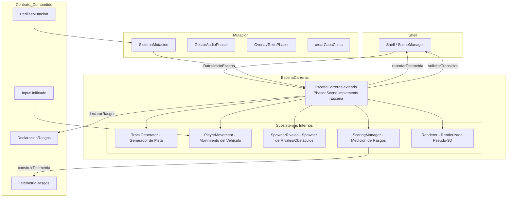
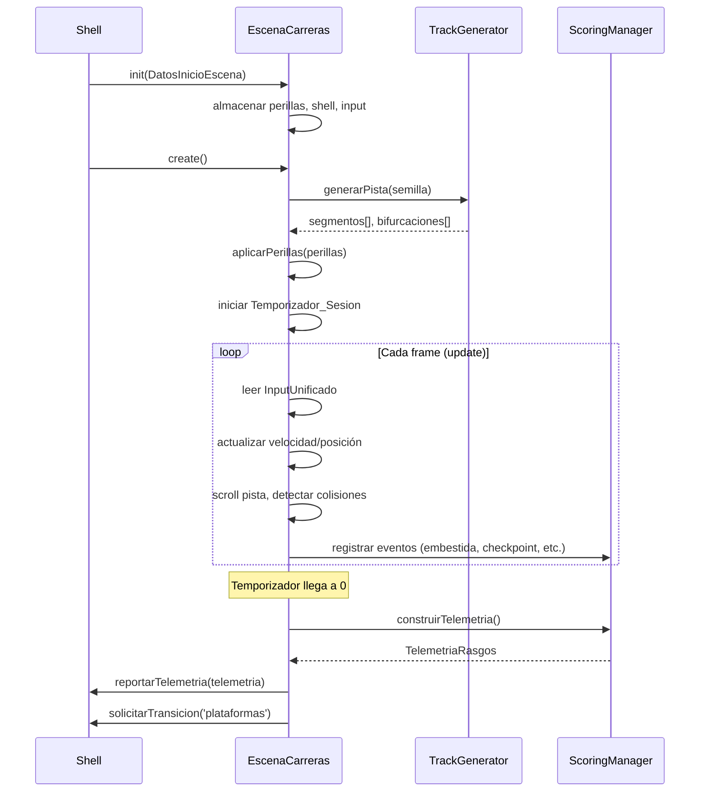

# Design Document — Escena_Carreras

## Overview

Escena_Carreras es el tercer nivel oculto opcional del juego Arcade IA Mutante. Implementa una experiencia de carrera pseudo-3D corta (60–90 segundos) con generación procedural de pista, midiendo los cuatro rasgos de personalidad (Furia, Curiosidad, Logro, Riesgo) a través de las acciones del jugador durante la carrera.

La escena ya existe como stub funcional (`EscenaCarreras.ts`) que cumple el Contrato_Compartido con `IEscena`. Este diseño define la arquitectura para implementar la jugabilidad completa, manteniendo la integración sin modificaciones al Shell ni al Motor_Scoring.

### Decisiones de Diseño Clave

1. **Enfoque visual pseudo-3D simplificado**: Se implementa un sistema de segmentos de pista con perspectiva usando escalado y desplazamiento vertical (estilo Mode 7 simplificado), con carriles discretos para el movimiento lateral. Esto permite sensación de velocidad sin la complejidad de un engine 3D completo.

2. **Generación procedural con semilla determinística**: La pista se genera al inicio de cada sesión usando una semilla derivada del timestamp, garantizando reproducibilidad para debugging y variedad entre sesiones.

3. **Reutilización del patrón de escena existente**: Se sigue la misma arquitectura que NivelRitmo y NivelShooter: init/create/update ciclo de vida, SistemaMutacion como orquestador de perillas, y emisión de TelemetriaRasgos al finalizar.

4. **Medición de rasgos integrada al gameplay**: Cada acción natural de la carrera alimenta un rasgo sin que el jugador necesite "perseguir" métricas explícitamente.

## Architecture



### Flujo de Ejecución Principal



## Components and Interfaces

### EscenaCarreras (Clase Principal)

Extiende `Phaser.Scene` e implementa `IEscena`. Orquesta todos los subsistemas internos.

```typescript
export class EscenaCarreras extends Phaser.Scene implements IEscena {
  readonly id: EscenaId = 'carreras';

  // Contrato_Compartido
  private shell: IShell | null;
  private entradaInput: InputUnificado | null;
  private perillasIniciales: PerillasMutacion;

  // Subsistemas
  private trackGenerator: TrackGenerator;
  private scoringManager: ScoringManager;
  private spawnerRivales: SpawnerRivalesCarreras;
  private sistemaMutacion: SistemaMutacion;

  // Estado de sesión
  private velocidadActual: number;
  private velocidadMaxima: number;
  private posicionLateral: number;
  private temporizadorMs: number;
  private finalizado: boolean;

  // IEscena
  init(datos: DatosInicioEscena): void;
  preload(): void;
  create(): void;
  update(tiempo: number, deltaMs: number): void;
  declararRasgos(): DeclaracionRasgos;
  aplicarPerillas(perillas: PerillasMutacion): void;
  construirTelemetria(): TelemetriaRasgos;
  setInput(input: InputUnificado): void;
}
```

### TrackGenerator (Generación Procedural de Pista)

Módulo puro (sin dependencia de Phaser) que genera la secuencia de segmentos de pista.

```typescript
export interface SegmentoPista {
  tipo: 'recta' | 'curva_izq' | 'curva_der';
  longitud: number; // en unidades de segmento
  bifurcacion: boolean; // si hay Ruta_Alternativa
  tieneCheckpoint: boolean;
}

export interface PistaGenerada {
  segmentos: SegmentoPista[];
  totalCheckpoints: number;
  totalBifurcaciones: number;
  semilla: number;
}

export class TrackGenerator {
  generar(semilla: number, duracionSesionMs: number): PistaGenerada;
}
```

### ScoringManager (Medición de Rasgos)

Módulo puro que acumula señales y oportunidades por rasgo.

```typescript
export interface EstadoScoring {
  furia: { senal: number; oportunidad: number };
  curiosidad: { senal: number; oportunidad: number };
  logro: { senal: number; oportunidad: number };
  riesgo: { senal: number; oportunidad: number };
}

export class ScoringManager {
  private estado: EstadoScoring;

  inicializar(pista: PistaGenerada, duracionMs: number): void;
  registrarEmbestida(): void;
  registrarRutaAlternativa(): void;
  registrarCheckpoint(): void;
  registrarAdelantar(): void;
  registrarPasadaAlRas(): void;
  acumularVelocidadAlta(deltaMs: number, velocidadActual: number, 
                         velocidadMaxima: number, umbral: number): void;
  obtenerEstado(): Readonly<EstadoScoring>;
  construirTelemetria(): TelemetriaRasgos;
  declararRasgos(): DeclaracionRasgos;
}
```

### SpawnerRivalesCarreras

Implementa `SpawnerEnemigos` del Contrato_Compartido para el contexto de mutación.

```typescript
export class SpawnerRivalesCarreras implements SpawnerEnemigos {
  private intensidad: number; // [0, 1]
  private agresividad: number; // [0, 1]
  private rivalesActivos: Rival[];

  ajustarIntensidad(intensidad: number): void;
  ajustarAgresividad(agresividad: number): void;
  spawnear(segmentoActual: SegmentoPista): Rival | null;
  actualizarRivales(deltaMs: number): void;
}
```

### Constantes de Configuración

```typescript
// Velocidad
const VELOCIDAD_BASE = 50;        // velocidad mínima (desacelerado total)
const VELOCIDAD_MAXIMA = 300;     // tope sin boost
const ACELERACION = 150;          // unidades/s²
const DESACELERACION = 80;        // unidades/s² (natural)
const FRENADO_ACTIVO = 200;       // unidades/s² (con acción secundaria)
const BOOST_MULTIPLICADOR = 1.4;  // factor temporal del boost
const BOOST_DURACION_MS = 2000;   // duración del boost
const BOOST_COOLDOWN_MS = 5000;   // cooldown entre boosts

// Pista
const UMBRAL_ALTA_VELOCIDAD = 0.8; // 80% de velocidad máxima
const MARGEN_PASADA_AL_RAS = 15;   // píxeles de proximidad sin colisión
const ANCHO_PISTA = 200;           // ancho visual de la pista
const CARRILES = 5;                // posiciones laterales discretas

// Sesión
const DURACION_MIN_MS = 60000;
const DURACION_MAX_MS = 90000;
const DURACION_DEFECTO_MS = 75000;
```

## Data Models

### Estado de la Sesión de Carrera

```typescript
interface EstadoSesion {
  tiempoRestanteMs: number;
  velocidadActual: number;
  posicionLateral: number; // carril actual [-2..2] para 5 carriles
  distanciaRecorrida: number;
  segmentoActual: number;
  enRutaAlternativa: boolean;
  boostActivo: boolean;
  boostCooldownMs: number;
}
```

### Rival (Vehículo IA)

```typescript
interface Rival {
  id: number;
  carril: number;
  distancia: number; // posición Z relativa al jugador
  velocidad: number;
  activo: boolean;
}
```

### Obstáculo

```typescript
interface Obstaculo {
  id: number;
  carril: number;
  distancia: number;
  tipo: 'estatico' | 'lento';
}
```

### Evento de Scoring

```typescript
type EventoScoring =
  | { tipo: 'embestida'; rivalId: number }
  | { tipo: 'ruta_alternativa'; indice: number }
  | { tipo: 'checkpoint'; indice: number }
  | { tipo: 'adelantar'; rivalId: number }
  | { tipo: 'pasada_al_ras'; objetoId: number }
  | { tipo: 'velocidad_alta'; deltaMs: number };
```

### Configuración Generada de Pista

```typescript
interface ConfigPista {
  segmentos: SegmentoPista[];
  semilla: number;
  totalCheckpoints: number;
  rutasAlternativas: number; // garantizado >= 3
  rivalesBase: number; // antes de aplicar intensidad_enemigos
}
```


## Correctness Properties

*A property is a characteristic or behavior that should hold true across all valid executions of a system — essentially, a formal statement about what the system should do. Properties serve as the bridge between human-readable specifications and machine-verifiable correctness guarantees.*

### Property 1: Lateral movement respects direction and bounds

*For any* current lateral position and any directional input (left or right), moving the vehicle SHALL produce a new position that (a) shifts in the correct direction and (b) remains within the track limits `[-maxCarril, +maxCarril]`.

**Validates: Requirements 1.2, 11.1, 11.2**

### Property 2: Acceleration is capped at Velocidad_Maxima

*For any* current velocity in `[VELOCIDAD_BASE, VELOCIDAD_MAXIMA]` and any positive deltaMs, applying acceleration SHALL produce a velocity that never exceeds `VELOCIDAD_MAXIMA`.

**Validates: Requirements 1.3, 11.3**

### Property 3: Deceleration is floored at Velocidad_Base

*For any* current velocity in `[VELOCIDAD_BASE, VELOCIDAD_MAXIMA]` and any positive deltaMs, applying natural deceleration SHALL produce a velocity that never goes below `VELOCIDAD_BASE`.

**Validates: Requirements 1.4**

### Property 4: Active braking is faster than natural deceleration

*For any* current velocity above `VELOCIDAD_BASE` and any positive deltaMs, the velocity reduction from active braking SHALL always be greater than the reduction from natural deceleration.

**Validates: Requirements 1.5, 11.5**

### Property 5: Obstacle collision always reduces velocity

*For any* current velocity above `VELOCIDAD_BASE`, a collision with an obstacle SHALL produce a new velocity strictly less than the previous velocity and not below `VELOCIDAD_BASE`.

**Validates: Requirements 1.6**

### Property 6: Session duration is clamped to [60000, 90000] ms

*For any* input duration value (positive integer), the resulting session duration SHALL be clamped to the range `[60000, 90000]` milliseconds.

**Validates: Requirements 2.1**

### Property 7: Timer expiry triggers finalization exactly once

*For any* session state where elapsed time >= session duration, calling update SHALL trigger finalization (reportarTelemetria + solicitarTransicion) exactly once, and subsequent update calls SHALL not trigger finalization again.

**Validates: Requirements 2.3**

### Property 8: Embestida increments Furia signal

*For any* sequence of N embestida events against rivals, the Furia signal SHALL equal exactly N.

**Validates: Requirements 1.7, 3.2**

### Property 9: Route taken increments Curiosidad signal

*For any* sequence of N route-taken events, the Curiosidad signal SHALL equal exactly N.

**Validates: Requirements 4.3**

### Property 10: Scoring events increment Logro signal

*For any* sequence of checkpoint-reached and overtake events totaling N, the Logro signal SHALL equal exactly N.

**Validates: Requirements 5.3, 5.4**

### Property 11: High-speed risk accumulation is proportional and conditional

*For any* velocity above `Umbral_Alta_Velocidad * VELOCIDAD_MAXIMA` and any positive deltaMs, the Riesgo signal SHALL increase. *For any* velocity at or below the threshold, the Riesgo signal SHALL not increase from speed accumulation.

**Validates: Requirements 6.2**

### Property 12: Near-miss increments Riesgo signal

*For any* sequence of N near-miss (Pasada_Al_Ras) events, the Riesgo signal SHALL increase by exactly N.

**Validates: Requirements 6.3**

### Property 13: Telemetry structure preserves all accumulated signals

*For any* accumulated scoring state (furia, curiosidad, logro, riesgo signals and opportunities), `construirTelemetria()` SHALL return a `TelemetriaRasgos` with `escena = 'carreras'` and each trait's `senal` and `oportunidad` matching the accumulated state exactly.

**Validates: Requirements 3.3, 4.4, 5.5, 6.4, 7.4**

### Property 14: All trait declarations have opportunity > 0

*For any* generated track configuration, `declararRasgos()` SHALL return a `DeclaracionRasgos` where all four trait opportunities (furia, curiosidad, logro, riesgo) are greater than zero.

**Validates: Requirements 3.1, 4.1, 5.1, 6.1**

### Property 15: Track generation guarantees minimum 3 alternative routes

*For any* seed value, the generated track SHALL contain at least 3 bifurcation points (Rutas_Alternativas).

**Validates: Requirements 4.2, 10.5**

### Property 16: Checkpoints are distributed at regular intervals

*For any* generated track, the distance between consecutive checkpoints SHALL not vary by more than 50% of the average checkpoint interval.

**Validates: Requirements 5.2**

### Property 17: Track generation is deterministic (same seed = same track)

*For any* seed value, generating a track twice with the same seed and session duration SHALL produce identical segment sequences.

**Validates: Requirements 10.4**

### Property 18: Track generation includes all segment types

*For any* seed value, the generated track SHALL contain at least one segment of each type: recta, curva_izq, curva_der.

**Validates: Requirements 10.2**

### Property 19: Different seeds produce different bifurcation positions

*For any* two distinct seed values, the positions of bifurcation points in the generated tracks SHALL differ (with high probability).

**Validates: Requirements 10.3**

### Property 20: init stores all DatosInicioEscena values

*For any* valid `DatosInicioEscena` containing perillas, shell, and input, after calling `init(datos)`, the scene SHALL hold references to all three values.

**Validates: Requirements 7.2**

### Property 21: Boost respects cooldown

*For any* state where a boost was activated less than `BOOST_COOLDOWN_MS` ago, attempting to activate boost again SHALL have no effect. *For any* state where cooldown has elapsed, activating boost SHALL temporarily increase velocity beyond normal `VELOCIDAD_MAXIMA`.

**Validates: Requirements 11.4**

### Property 22: Spawner scales with perilla values

*For any* `intensidad_enemigos` value in `[0, 1]`, a higher value SHALL produce equal or greater rival spawn probability. *For any* `agresividad` value in `[0, 1]`, a higher value SHALL produce equal or greater rival velocity.

**Validates: Requirements 8.2, 8.3**

## Error Handling

### Degradación Grácil sin Shell

Si el Shell no está cableado (modo standalone/testing), la escena:
- Almacena `null` para el shell
- Registra la telemetría por consola en lugar de romper
- No solicita transición (queda en su estado final)

### Personaje no Seleccionado

Si no hay personaje seleccionado en el registry de Phaser:
- Redirige a `seleccion_personaje` via `shell.solicitarTransicion()`
- Si no hay shell disponible, emite warning por consola y retorna sin crear la escena

### Perillas Inválidas o Ausentes

Si `DatosInicioEscena` es parcial o nulo:
- Usa perillas por defecto (paleta 'neon', clima 'ninguno', etc.)
- No arroja excepciones

### Colisiones Múltiples en un Frame

Si el jugador colisiona con múltiples objetos en el mismo frame:
- Cada colisión se procesa de forma independiente
- La penalización de velocidad se aplica una sola vez (la mayor)
- Los eventos de scoring se registran todos

### Generación de Pista con Semilla Edge-Case

Si la semilla produce una pista con menos de 3 rutas alternativas:
- El generador inyecta bifurcaciones adicionales en posiciones aleatorias hasta cumplir el mínimo
- Esto garantiza que `declararRasgos()` siempre retorne oportunidad > 0 para curiosidad

## Testing Strategy

### Enfoque Dual: Unit Tests + Property Tests

El feature se testea con dos enfoques complementarios:

#### Property-Based Tests (fast-check)

La lógica pura de la escena (TrackGenerator, ScoringManager, física de velocidad) se valida mediante property-based testing con `fast-check`. Cada propiedad del documento de diseño se implementa como un test con mínimo 100 iteraciones.

**Librería**: `fast-check` (ya disponible en devDependencies)

**Configuración**:
- Mínimo 100 iteraciones por propiedad
- Cada test taggeado con: `Feature: escena-carreras, Property {N}: {texto}`

**Módulos testeables por propiedades**:
1. **TrackGenerator** (Properties 15, 16, 17, 18, 19): generación procedural pura, determinismo, invariantes de estructura
2. **ScoringManager** (Properties 8, 9, 10, 11, 12, 13, 14): acumulación de señales, construcción de telemetría
3. **Física de velocidad** (Properties 2, 3, 4, 5, 6): aceleración, frenado, colisiones, clamping
4. **Movimiento lateral** (Property 1): bounds checking
5. **Sesión** (Properties 7, 20, 21): timer, init, boost cooldown

#### Unit Tests (vitest)

Para casos específicos, edge cases y comportamiento de integración:

- Inicialización de escena sin Shell (degradación grácil)
- Orden de llamadas al finalizar (telemetría antes de transición)
- Aplicación de perillas via SistemaMutacion (integración)
- HUD muestra elementos esperados
- Personaje no seleccionado redirige correctamente

#### Patrón de Mocking

Siguiendo el patrón establecido en `NivelRitmo.test.ts`:
- Mock mínimo de Phaser (`Scene` class + `Math.Clamp`)
- Acceso a internos via casting (`as unknown as EscenaInterna`)
- Shell mock con espías de vitest
- InputUnificado mock configurable para simular combinaciones de entrada

### Cobertura por Requisito

| Requisito | Tipo de Test | Properties |
|-----------|-------------|------------|
| Req 1 (Mecánica) | Property + Unit | 1, 2, 3, 4, 5, 8 |
| Req 2 (Duración) | Property + Unit | 6, 7 |
| Req 3 (Furia) | Property | 8, 13, 14 |
| Req 4 (Curiosidad) | Property | 9, 13, 14, 15 |
| Req 5 (Logro) | Property | 10, 13, 14, 16 |
| Req 6 (Riesgo) | Property | 11, 12, 13, 14 |
| Req 7 (Contrato) | Property + Unit | 13, 20 |
| Req 8 (Mutación) | Unit + Integration | 22 |
| Req 9 (Estética) | Unit/Smoke | — |
| Req 10 (Generación) | Property | 15, 16, 17, 18, 19 |
| Req 11 (Controles) | Property | 1, 2, 4, 21 |
