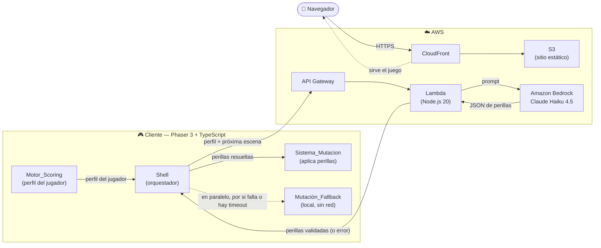
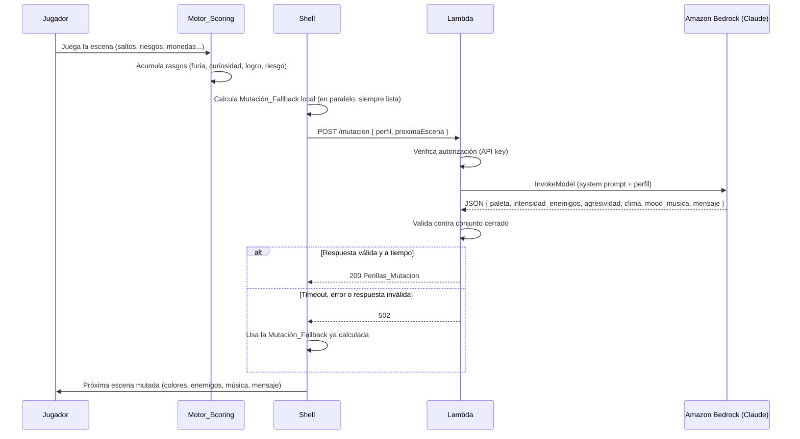

# 999 EN 1 — Arcade IA Mutante

Juego arcade web 8-bit donde una **IA (Amazon Bedrock — Claude Haiku 4.5)** muta la estética y dificultad de cada escena en tiempo real según cómo juega cada persona.

🎮 **Jugalo online:** https://d2xslelurqyc18.cloudfront.net

## Qué hace la IA

Después de cada escena, el juego analiza tu estilo de juego (furia, curiosidad, logro, riesgo) y le pregunta a Claude: "¿cómo muto el juego para este jugador?". Claude responde con:
- **Paleta de colores** (infierno, sueño, neón, hostil)
- **Intensidad de enemigos** y **agresividad**
- **Clima** (lluvia, brasas, niebla)
- **Mood de música** (calma, épico, tenso, furioso)
- **Mensaje personalizado** al jugador

Si la IA no responde a tiempo, un fallback local garantiza que el juego nunca se quede trabado.

## Stack tecnológico

| Capa | Tecnología |
|------|-----------|
| Cliente | Phaser 3.80 + TypeScript, Vite |
| Backend | AWS Lambda (Node.js 20) + Amazon Bedrock |
| IA | Claude Haiku 4.5 (Anthropic) vía inference profile cross-region |
| Infra | AWS CDK — S3 + CloudFront + API Gateway + Lambda |
| Testing | Vitest + fast-check (property-based testing) |

## Escenas del juego

- **Plataformas** — Escena principal: correr, saltar, recolectar monedas, explorar portales ocultos
- **Ritmo** — Mini-juego musical: presionar teclas al ritmo de las notas
- **Shooter** — Naves espaciales: esquivar y disparar aliens
- **Carreras** — Esquivar obstáculos y rivales en una carretera

## Arquitectura



### Flujo de una mutación



## Cómo correr en local

```bash
npm install
npm run dev          # Abre http://localhost:5173
```

Para que la IA funcione en local, creá un `.env` con:
```
VITE_MUTACION_ENDPOINT=https://tu-api-gateway.amazonaws.com/prod/mutacion
VITE_MUTACION_API_KEY=tu-api-key
```

Sin `.env`, el juego funciona igual usando el fallback local (sin IA).

## Build y deploy

```bash
# Build del cliente
npm run build

# Build de la Lambda
npm run build:lambda

# Deploy de infraestructura (requiere AWS CLI + credenciales)
cd infra
npm install
npx cdk deploy -c bedrockModelId=anthropic.claude-haiku-4-5-20251001-v1:0

# Subir cliente a S3
aws s3 sync dist/ s3://NOMBRE-DEL-BUCKET --delete
aws cloudfront create-invalidation --distribution-id ID --paths "/*"
```

## Estructura de carpetas

```
999EN1/
├── src/
│   ├── contrato/       # Tipos e interfaces compartidos (conjunto cerrado)
│   ├── motor/          # Motor_Scoring (lógica pura, determinística)
│   ├── mutacion/       # Sistema_Mutacion + validador + fallback
│   ├── input/          # InputUnificado (abstracción de teclado)
│   ├── escenas/        # Nivel_Plataformas, Nivel_Ritmo, Nivel_Shooter, Escena_Carreras
│   ├── shell/          # SceneManager, BootScene, LoadingScene, resolución de perillas
│   ├── backend/        # Handler Lambda (Bedrock)
│   └── audio/          # Efectos de sonido
├── infra/              # AWS CDK (S3, CloudFront, API Gateway, Lambda, IAM)
└── .kiro/
    ├── specs/          # Especificaciones (requirements, design, tasks)
    └── steering/       # Guías de código, arquitectura, testing
```

## Tests

```bash
npm run test           # Vitest (single run)
npm run test:watch     # Vitest (watch mode)
npm run typecheck      # TypeScript sin emitir
```

## Limpiar recursos AWS

```bash
cd infra
npx cdk destroy
```

## Equipo

Proyecto para el Hackaton de Código Facilito.

## Desarrollo con Kiro

El proyecto fue desarrollado usando **Kiro** como IDE con asistencia de IA. Kiro gestionó las specs (requirements → design → tasks), generó la arquitectura modular, escribió los property-based tests con fast-check, y asistió en la implementación iterativa de cada módulo. Los steering files (`.kiro/steering/`) guiaron las convenciones de código, testing y arquitectura durante toda la sesión.

## Créditos de assets

| Asset | Fuente |
|-------|--------|
| Personajes | [Free Pixel Art Tiny Hero Sprites — CraftPix](https://craftpix.net/freebies/free-pixel-art-tiny-hero-sprites/) |
| Monedas | [Gems & Coins Free — LaRedGames](https://laredgames.itch.io/gems-coins-free) |
| Plataforma (tileset) | [Free Crystal Caves 2D Platformer Tileset — CraftPix](https://craftpix.net/freebies/free-crystal-caves-2d-platformer-tileset/) |
| Aliens | [Arcade Style Ghosts — Checkpoint Cafe](https://checkpointcafe.itch.io/arcadestyleghosts) |
| Dinamita | [Minerman Adventure — Tumas81](https://tumas81.itch.io/minerman-adventure) |
| Autos | [Top Down Pixel Art Race Cars — AIM Studios](https://aim-studios.itch.io/top-down-pixel-art-race-cars) |
| Árbol | [Árbol pixel PNG — Magnific](https://www.magnific.com/es/vectores/arbol-pixel-png) |
| Arbusto | [Pixel arbustos — Vecteezy](https://es.vecteezy.com/arte-vectorial/22908198-pixel-arbustos-o-arbustos-con-verdor-y-follaje) |
| Demon (enemigo) | [Flying Demon 2D Pixel Art — Xzany](https://xzany.itch.io/flying-demon-2d-pixel-art) |
